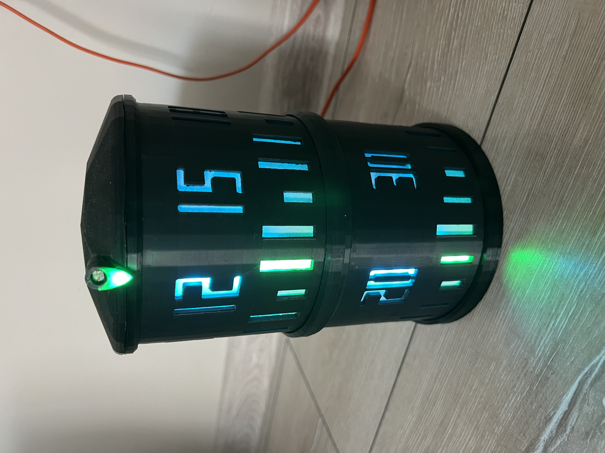
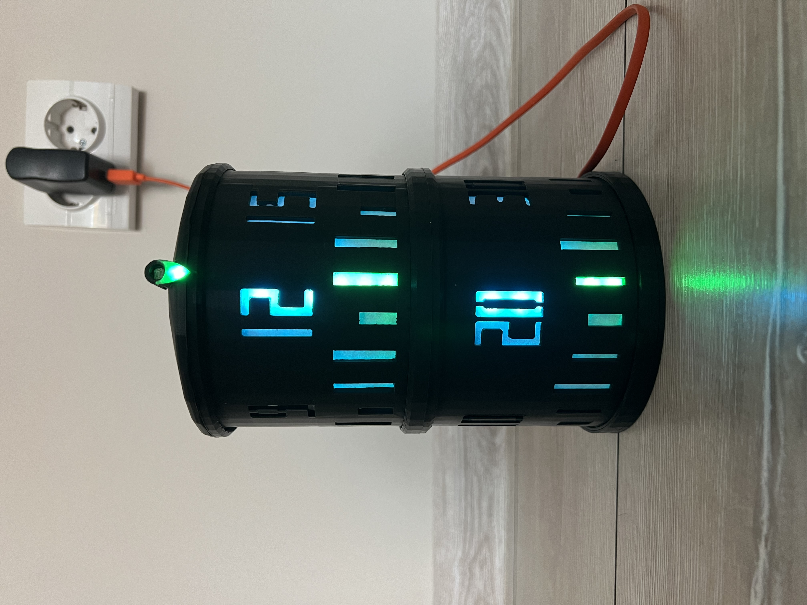

# RoundWatch

## Description
Multifunctional table clock designed from scratch using ESP32 platform as the core. Concept of design was to use two concentric cylinders as hours and minutes dials. 
Digits and divisions represented as holes in each cylinder. Time indication works by highlighting corresponding digit/division and cylinder movement. 
Watch could be updated via Bluetooth Low Energy or via Wi-Fi using Telegram bot.

## Real device images

